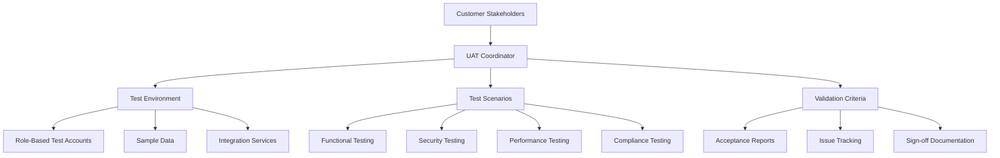

# SafeSpace User Acceptance Testing (UAT) Design

## Overview

This design document outlines the comprehensive User Acceptance Testing approach for SafeSpace, a mental health management platform. The UAT process is designed to validate that the platform meets all customer requirements and is ready for production deployment in mental health organizations.

## Architecture

### UAT Framework Structure



### Testing Phases

1. **Preparation Phase**: Environment setup and test data creation
2. **Execution Phase**: Systematic testing of all requirements
3. **Validation Phase**: Results review and issue resolution
4. **Approval Phase**: Customer sign-off and production readiness

## Components and Interfaces

### UAT Environment Components

#### Test Environment Setup
- **Staging Server**: Production-like environment with SafeSpace deployed
- **Test Database**: Populated with realistic sample data
- **Email Testing**: Configured with test email accounts
- **Google Workspace**: Test integration with Calendar and Meet
- **Monitoring Tools**: Performance and error tracking

#### Test User Accounts
- **Admin Test Account**: admin-test@safespace-uat.com
- **Therapist Test Accounts**: therapist1-test@safespace-uat.com, therapist2-test@safespace-uat.com
- **Guardian Test Accounts**: guardian1-test@safespace-uat.com, guardian2-test@safespace-uat.com
- **Child Test Accounts**: child1-test@safespace-uat.com, child2-test@safespace-uat.com

#### Sample Data Sets
- **User Profiles**: Realistic but anonymized user information
- **Mood Data**: Historical mood tracking data for trend analysis
- **Appointments**: Past and future appointments for scheduling tests
- **Messages**: Sample conversations for communication testing
- **Content**: Articles and resources for content management testing

### Testing Interface Components

#### UAT Dashboard
- **Test Progress Tracking**: Visual progress indicators for each requirement
- **Issue Management**: Bug reporting and resolution tracking
- **Results Documentation**: Automated test result compilation
- **Sign-off Workflow**: Digital approval process for stakeholders

#### Test Execution Tools
- **Test Case Management**: Structured test scenario execution
- **Screen Recording**: Capture test sessions for review
- **Performance Monitoring**: Real-time system performance tracking
- **Accessibility Testing**: Automated accessibility compliance checking

## Data Models

### UAT Test Case Structure

```typescript
interface UATTestCase {
  id: string;
  requirementId: string;
  title: string;
  description: string;
  userRole: 'Admin' | 'Therapist' | 'Guardian' | 'Child';
  preconditions: string[];
  testSteps: TestStep[];
  expectedResults: string[];
  actualResults?: string[];
  status: 'Not Started' | 'In Progress' | 'Passed' | 'Failed' | 'Blocked';
  priority: 'Critical' | 'High' | 'Medium' | 'Low';
  estimatedTime: number; // minutes
  actualTime?: number;
  tester: string;
  executionDate?: Date;
  screenshots?: string[];
  notes?: string;
}

interface TestStep {
  stepNumber: number;
  action: string;
  expectedResult: string;
  actualResult?: string;
  status?: 'Pass' | 'Fail' | 'Skip';
}
```

### UAT Results Model

```typescript
interface UATResults {
  testSuiteId: string;
  executionDate: Date;
  totalTestCases: number;
  passedTestCases: number;
  failedTestCases: number;
  blockedTestCases: number;
  overallStatus: 'In Progress' | 'Passed' | 'Failed' | 'Conditional Pass';
  criticalIssues: Issue[];
  recommendations: string[];
  customerApproval?: {
    approved: boolean;
    approver: string;
    approvalDate: Date;
    conditions?: string[];
  };
}

interface Issue {
  id: string;
  severity: 'Critical' | 'High' | 'Medium' | 'Low';
  category: 'Functional' | 'Security' | 'Performance' | 'Usability' | 'Compliance';
  description: string;
  stepsToReproduce: string[];
  expectedBehavior: string;
  actualBehavior: string;
  impact: string;
  status: 'Open' | 'In Progress' | 'Resolved' | 'Closed';
  assignee?: string;
  resolution?: string;
}
```

## Correctness Properties

*A property is a characteristic or behavior that should hold true across all valid executions of a system—essentially, a formal statement about what the system should do. Properties serve as the bridge between human-readable specifications and machine-verifiable correctness guarantees.*

### Property 1: Test Coverage Completeness
*For any* UAT requirement in the specification, there must exist at least one corresponding test case that validates all acceptance criteria for that requirement.
**Validates: Requirements 1.1-12.6**

### Property 2: Role-Based Access Validation
*For any* user role and system function, the UAT process must verify that access controls work correctly and users can only perform actions appropriate to their role.
**Validates: Requirements 1.1-1.6, 2.1-2.6**

### Property 3: Data Integrity Preservation
*For any* data operation tested during UAT, the system must maintain data consistency and integrity throughout all user interactions and system processes.
**Validates: Requirements 3.1-3.6, 10.1-10.6**

### Property 4: Communication Security Enforcement
*For any* communication feature tested, the system must enforce appropriate security measures, content moderation, and oversight according to user roles and safety requirements.
**Validates: Requirements 5.1-5.6, 10.1-10.6**

### Property 5: Integration Service Reliability
*For any* third-party service integration, the UAT process must verify that the system handles both successful operations and failure scenarios gracefully.
**Validates: Requirements 12.1-12.6**

### Property 6: Mobile Responsiveness Consistency
*For any* platform feature accessed on mobile devices, the interface must maintain usability, accessibility, and functionality equivalent to desktop versions.
**Validates: Requirements 9.1-9.6**

### Property 7: Performance Under Load
*For any* system operation tested under simulated load conditions, response times and system stability must remain within acceptable parameters defined for production use.
**Validates: Requirements 11.1-11.6**

### Property 8: Compliance Requirement Adherence
*For any* feature involving child data or healthcare information, the system must demonstrate compliance with COPPA, HIPAA, and other relevant regulations throughout the UAT process.
**Validates: Requirements 2.1-2.6, 10.1-10.6**

## Error Handling

### UAT Process Error Scenarios

#### Test Environment Issues
- **Database Connection Failures**: Automated retry mechanisms with fallback procedures
- **Service Integration Outages**: Clear documentation of dependencies and workarounds
- **Performance Degradation**: Monitoring alerts with escalation procedures
- **Data Corruption**: Backup and restore procedures for test data

#### Test Execution Problems
- **Incomplete Test Cases**: Validation rules to ensure all required fields are completed
- **Conflicting Test Results**: Review process with senior tester validation
- **Blocked Test Scenarios**: Alternative test paths and dependency management
- **Time Overruns**: Flexible scheduling with priority-based execution

#### Customer Communication Issues
- **Unclear Requirements**: Structured clarification process with documented decisions
- **Changing Expectations**: Change management workflow with impact assessment
- **Approval Delays**: Escalation procedures with defined timelines
- **Technical Understanding Gaps**: Educational materials and guided demonstrations

## Testing Strategy

### Dual Testing Approach

The UAT process employs both **manual testing** and **automated validation** to ensure comprehensive coverage:

#### Manual Testing Focus
- **User Experience Validation**: Real user interactions and workflow testing
- **Visual Design Review**: Interface aesthetics and branding consistency
- **Accessibility Testing**: Screen reader compatibility and keyboard navigation
- **Edge Case Scenarios**: Unusual but possible user behaviors
- **Integration Points**: Cross-system functionality and data flow

#### Automated Validation Focus
- **Regression Testing**: Ensuring existing functionality remains intact
- **Performance Benchmarks**: Load testing and response time validation
- **Security Scanning**: Vulnerability assessment and penetration testing
- **Data Integrity Checks**: Database consistency and backup procedures
- **API Endpoint Testing**: Service reliability and error handling

### Test Execution Configuration

#### Test Environment Specifications
- **Minimum 100 test scenarios** covering all critical user journeys
- **Performance testing** with simulated load of 50+ concurrent users
- **Security testing** including penetration testing and vulnerability scans
- **Accessibility testing** meeting WCAG 2.1 AA standards
- **Mobile testing** across iOS and Android devices

#### Test Case Tagging System
Each test case must be tagged with:
- **Feature: acceptance-testing, Requirement {number}: {requirement_text}**
- **Priority Level**: Critical, High, Medium, Low
- **User Role**: Admin, Therapist, Guardian, Child
- **Test Type**: Functional, Security, Performance, Usability, Compliance

### UAT Execution Timeline

#### Phase 1: Preparation (Week 1)
- Environment setup and configuration
- Test data creation and validation
- Test case review and approval
- Tester training and orientation

#### Phase 2: Core Functionality Testing (Week 2)
- Authentication and user management
- Mood tracking and analytics
- Appointment scheduling and video sessions
- Communication and messaging

#### Phase 3: Advanced Features Testing (Week 3)
- Content management and moderation
- Email notifications and preferences
- Security and compliance validation
- Performance and scalability testing

#### Phase 4: Integration and Final Validation (Week 4)
- Third-party service integration testing
- End-to-end workflow validation
- Issue resolution and retesting
- Customer review and sign-off

### Success Criteria

#### Acceptance Thresholds
- **Critical Issues**: 0 unresolved critical issues
- **High Priority Issues**: Maximum 2 unresolved high priority issues
- **Test Pass Rate**: Minimum 95% of test cases must pass
- **Performance Benchmarks**: All response times within defined SLAs
- **Security Compliance**: 100% compliance with security requirements
- **Accessibility Standards**: Full WCAG 2.1 AA compliance

#### Customer Approval Requirements
- **Functional Sign-off**: All core features validated and approved
- **Security Approval**: Security assessment completed and accepted
- **Performance Acceptance**: Load testing results meet expectations
- **Compliance Verification**: All regulatory requirements validated
- **User Experience Approval**: Interface and usability meet standards

### Deliverables

#### UAT Documentation Package
1. **Executive Summary**: High-level results and recommendations
2. **Detailed Test Results**: Complete test case execution results
3. **Issue Register**: All identified issues with resolution status
4. **Performance Report**: Load testing and benchmark results
5. **Security Assessment**: Vulnerability scan and penetration test results
6. **Compliance Certification**: COPPA and healthcare regulation validation
7. **User Acceptance Certificate**: Formal customer approval document
8. **Production Readiness Checklist**: Final deployment validation

#### Ongoing Support Materials
- **User Training Materials**: Role-based training guides
- **Administrator Handbook**: System management procedures
- **Troubleshooting Guide**: Common issues and resolutions
- **Maintenance Schedule**: Recommended update and backup procedures