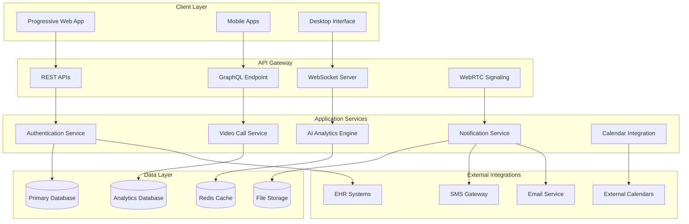

# SafeSpace 7-Week Platform Enhancement - Design Document

## Overview

This design document outlines a comprehensive 7-week enhancement plan that transforms SafeSpace into a world-class, enterprise-grade mental health platform. Building on the successful 3-day UI foundation, this plan adds advanced features, AI-powered insights, real-time communication, and enterprise capabilities while maintaining the medical-grade design and emotional safety that defines SafeSpace.

## Architecture

### System Architecture Evolution



### Technology Stack Enhancements

#### Frontend Enhancements
- **Theme System**: CSS-in-JS with theme switching capabilities
- **Animation Library**: Framer Motion for smooth, therapeutic animations
- **PWA Framework**: Workbox for offline functionality and caching
- **Real-time Updates**: Socket.io for live data synchronization
- **Video Integration**: WebRTC with fallback to cloud services

#### Backend Enhancements
- **Microservices**: Modular services for scalability
- **Message Queue**: Redis/RabbitMQ for async processing
- **AI/ML Pipeline**: Python services for analytics and predictions
- **WebRTC Signaling**: Node.js signaling server for video calls
- **File Processing**: Background jobs for media handling

#### Infrastructure
- **Container Orchestration**: Docker with Kubernetes for scaling
- **CDN Integration**: Global content delivery for performance
- **Monitoring**: Comprehensive logging and performance tracking
- **Security**: Enhanced encryption and compliance tools

## Components and Interfaces

### Week 1: Advanced User Experience

#### 1. Theme System Architecture

```typescript
interface ThemeConfig {
  mode: 'light' | 'dark' | 'auto';
  colors: {
    primary: ColorPalette;
    secondary: ColorPalette;
    background: ColorPalette;
    surface: ColorPalette;
    text: ColorPalette;
    status: StatusColors;
  };
  animations: {
    duration: AnimationDurations;
    easing: EasingFunctions;
    reducedMotion: boolean;
  };
  accessibility: {
    fontSize: 'small' | 'medium' | 'large' | 'extra-large';
    contrast: 'normal' | 'high';
    focusVisible: boolean;
  };
}

interface ColorPalette {
  50: string;
  100: string;
  200: string;
  300: string;
  400: string;
  500: string;
  600: string;
  700: string;
  800: string;
  900: string;
}
```

#### 2. Animation System

```typescript
interface AnimationConfig {
  pageTransitions: {
    enter: MotionProps;
    exit: MotionProps;
    duration: number;
  };
  microInteractions: {
    button: MotionProps;
    card: MotionProps;
    form: MotionProps;
  };
  loading: {
    skeleton: MotionProps;
    spinner: MotionProps;
    progress: MotionProps;
  };
}

const therapeuticEasing = {
  gentle: [0.25, 0.46, 0.45, 0.94],
  calm: [0.4, 0.0, 0.2, 1],
  soothing: [0.25, 0.1, 0.25, 1]
};
```

#### 3. Personalization Engine

```typescript
interface UserPreferences {
  theme: ThemeConfig;
  dashboard: DashboardLayout;
  notifications: NotificationSettings;
  accessibility: AccessibilitySettings;
  privacy: PrivacySettings;
}

interface DashboardLayout {
  widgets: WidgetConfig[];
  layout: 'grid' | 'list' | 'custom';
  density: 'compact' | 'comfortable' | 'spacious';
}
```

### Week 2: Real-time Communication

#### 4. Video Call System

```typescript
interface VideoCallService {
  initializeCall(participants: Participant[]): Promise<CallSession>;
  joinCall(sessionId: string): Promise<MediaStream>;
  endCall(sessionId: string): Promise<void>;
  toggleVideo(): void;
  toggleAudio(): void;
  shareScreen(): Promise<MediaStream>;
  recordSession(): Promise<RecordingSession>;
}

interface CallSession {
  id: string;
  participants: Participant[];
  startTime: Date;
  duration: number;
  quality: 'low' | 'medium' | 'high' | 'auto';
  encryption: boolean;
  recording?: RecordingSession;
}
```

#### 5. Enhanced Messaging

```typescript
interface Message {
  id: string;
  conversationId: string;
  senderId: string;
  content: MessageContent;
  timestamp: Date;
  status: 'sent' | 'delivered' | 'read';
  reactions?: Reaction[];
  attachments?: Attachment[];
}

interface MessageContent {
  text?: string;
  richText?: RichTextContent;
  media?: MediaContent;
  location?: LocationContent;
}

interface Conversation {
  id: string;
  type: 'direct' | 'group' | 'therapy_session';
  participants: Participant[];
  settings: ConversationSettings;
  moderators?: string[];
}
```

#### 6. Crisis Intervention System

```typescript
interface CrisisDetectionEngine {
  analyzeContent(content: string): CrisisRiskLevel;
  detectPatterns(userId: string): CrisisIndicators;
  triggerIntervention(level: CrisisRiskLevel): InterventionResponse;
  notifyEmergencyContacts(userId: string): Promise<void>;
}

interface CrisisRiskLevel {
  level: 'low' | 'medium' | 'high' | 'critical';
  confidence: number;
  indicators: string[];
  recommendations: string[];
}
```

### Week 3: AI-Powered Analytics

#### 7. Mood Analytics Engine

```typescript
interface MoodAnalyticsService {
  analyzeMoodPatterns(userId: string, timeframe: TimeFrame): MoodAnalysis;
  identifyTriggers(userId: string): TriggerAnalysis;
  generateInsights(userId: string): TherapeuticInsights;
  predictMoodTrends(userId: string): MoodPrediction;
}

interface MoodAnalysis {
  trends: MoodTrend[];
  patterns: MoodPattern[];
  correlations: MoodCorrelation[];
  recommendations: Recommendation[];
}

interface TherapeuticInsights {
  progressIndicators: ProgressIndicator[];
  concernAreas: ConcernArea[];
  strengths: Strength[];
  actionItems: ActionItem[];
}
```

#### 8. Predictive Analytics

```typescript
interface PredictiveAnalyticsEngine {
  analyzeRiskFactors(userId: string): RiskAssessment;
  predictOutcomes(interventionType: string): OutcomePrediction;
  generateRecommendations(context: TherapeuticContext): Recommendation[];
  updateModels(feedbackData: FeedbackData): void;
}

interface RiskAssessment {
  overallRisk: RiskLevel;
  specificRisks: SpecificRisk[];
  protectiveFactors: ProtectiveFactor[];
  interventionSuggestions: InterventionSuggestion[];
}
```

### Week 4: Advanced Features

#### 9. Calendar Integration System

```typescript
interface CalendarService {
  syncExternalCalendars(providers: CalendarProvider[]): Promise<void>;
  scheduleAppointment(appointment: AppointmentRequest): Promise<Appointment>;
  sendReminders(appointment: Appointment): Promise<void>;
  handleConflicts(conflicts: ScheduleConflict[]): ConflictResolution[];
}

interface Appointment {
  id: string;
  type: 'therapy' | 'consultation' | 'group' | 'assessment';
  participants: Participant[];
  scheduledTime: Date;
  duration: number;
  location: 'video' | 'in_person' | 'phone';
  reminders: ReminderConfig[];
  notes?: string;
}
```

#### 10. Resource Library

```typescript
interface ResourceLibrary {
  searchResources(query: SearchQuery): Resource[];
  getRecommendations(userId: string): Resource[];
  trackProgress(userId: string, resourceId: string): ProgressTracking;
  createCustomContent(content: ContentRequest): Resource;
}

interface Resource {
  id: string;
  type: 'article' | 'video' | 'exercise' | 'assessment' | 'game';
  title: string;
  description: string;
  content: ResourceContent;
  ageGroup: AgeGroup;
  difficulty: 'beginner' | 'intermediate' | 'advanced';
  tags: string[];
  estimatedDuration: number;
}
```

### Week 5: Platform Scalability

#### 11. PWA Architecture

```typescript
interface PWAService {
  installPrompt(): Promise<void>;
  updateAvailable(): boolean;
  syncOfflineData(): Promise<SyncResult>;
  cacheStrategy(resource: string): CacheStrategy;
  pushNotifications(): NotificationManager;
}

interface OfflineCapabilities {
  moodLogging: boolean;
  messaging: boolean;
  resources: boolean;
  crisisResources: boolean;
  appointments: boolean;
}
```

#### 12. Multi-tenant System

```typescript
interface TenantService {
  createTenant(config: TenantConfig): Promise<Tenant>;
  customizeBranding(tenantId: string, branding: BrandingConfig): Promise<void>;
  manageUsers(tenantId: string): UserManagement;
  isolateData(tenantId: string): DataIsolation;
}

interface Tenant {
  id: string;
  name: string;
  domain: string;
  branding: BrandingConfig;
  settings: TenantSettings;
  subscription: SubscriptionPlan;
}
```

### Week 6: Advanced Analytics

#### 13. Behavioral Analytics

```typescript
interface BehaviorAnalyticsEngine {
  trackUserJourney(userId: string): UserJourney;
  analyzeEngagement(timeframe: TimeFrame): EngagementMetrics;
  identifyDropoffPoints(): DropoffAnalysis;
  measureFeatureAdoption(): AdoptionMetrics;
}

interface UserJourney {
  touchpoints: Touchpoint[];
  conversions: Conversion[];
  dropoffs: Dropoff[];
  satisfaction: SatisfactionScore;
}
```

#### 14. Natural Language Processing

```typescript
interface NLPService {
  analyzeSessionNotes(notes: string): NoteAnalysis;
  extractThemes(conversations: Message[]): Theme[];
  detectSentiment(text: string): SentimentAnalysis;
  generateSummary(content: string): Summary;
}

interface NoteAnalysis {
  themes: Theme[];
  emotions: EmotionDetection[];
  progressIndicators: ProgressIndicator[];
  riskFactors: RiskFactor[];
  recommendations: Recommendation[];
}
```

### Week 7: Enterprise Integration

#### 15. Healthcare Integration

```typescript
interface EHRIntegration {
  syncPatientData(patientId: string): Promise<PatientRecord>;
  exportClinicalNotes(sessionId: string): Promise<ClinicalDocument>;
  importTreatmentPlan(planId: string): Promise<TreatmentPlan>;
  handleDataConflicts(conflicts: DataConflict[]): ConflictResolution[];
}

interface HL7FHIRService {
  createPatientResource(patient: Patient): FHIR.Patient;
  createObservationResource(mood: MoodEntry): FHIR.Observation;
  createEncounterResource(session: TherapySession): FHIR.Encounter;
  validateResource(resource: FHIR.Resource): ValidationResult;
}
```

## Data Models

### Enhanced User Models

```typescript
interface EnhancedUser extends User {
  preferences: UserPreferences;
  analytics: UserAnalytics;
  subscriptions: Subscription[];
  integrations: Integration[];
  aiInsights: AIInsights;
}

interface UserAnalytics {
  engagementScore: number;
  progressMetrics: ProgressMetric[];
  riskAssessment: RiskAssessment;
  outcomeTracking: OutcomeMetric[];
}
```

### AI/ML Models

```typescript
interface MLModel {
  id: string;
  type: 'mood_prediction' | 'risk_assessment' | 'outcome_prediction';
  version: string;
  accuracy: number;
  lastTrained: Date;
  features: ModelFeature[];
}

interface PredictionResult {
  prediction: any;
  confidence: number;
  explanation: string[];
  recommendations: Recommendation[];
}
```

### Communication Models

```typescript
interface VideoSession {
  id: string;
  type: 'therapy' | 'consultation' | 'group' | 'crisis';
  participants: SessionParticipant[];
  startTime: Date;
  endTime?: Date;
  quality: VideoQuality;
  recording?: SessionRecording;
  notes?: SessionNotes;
}

interface SessionRecording {
  id: string;
  duration: number;
  fileSize: number;
  encryption: EncryptionInfo;
  retention: RetentionPolicy;
  access: AccessControl[];
}
```

## Correctness Properties

*A property is a characteristic or behavior that should hold true across all valid executions of a system-essentially, a formal statement about what the system should do. Properties serve as the bridge between human-readable specifications and machine-verifiable correctness guarantees.*

### Week 1 Properties

#### Property 1: Theme Consistency
*For any* theme change, all UI components should consistently apply the new theme without visual artifacts or accessibility violations
**Validates: Requirements 1.1, 1.3**

#### Property 2: Animation Performance
*For any* animation or transition, the system should maintain 60fps performance and respect user motion preferences
**Validates: Requirements 2.2, 2.4**

#### Property 3: Preference Synchronization
*For any* user preference change, the setting should sync across all active sessions within 5 seconds
**Validates: Requirements 3.5**

### Week 2 Properties

#### Property 4: Video Call Security
*For any* video call session, all media streams should be end-to-end encrypted and HIPAA compliant
**Validates: Requirements 4.1, 4.5**

#### Property 5: Message Delivery Guarantee
*For any* message sent, the system should guarantee delivery or provide clear failure notification within 30 seconds
**Validates: Requirements 5.4**

#### Property 6: Crisis Response Time
*For any* crisis detection, emergency protocols should activate within 60 seconds of detection
**Validates: Requirements 6.1, 6.4**

### Week 3 Properties

#### Property 7: AI Prediction Accuracy
*For any* AI prediction, the system should maintain minimum 80% accuracy and provide confidence scores
**Validates: Requirements 8.3, 8.5**

#### Property 8: Data Privacy in Analytics
*For any* analytics operation, individual user data should remain anonymized and aggregated appropriately
**Validates: Requirements 7.5, 9.5**

### Week 4 Properties

#### Property 9: Calendar Synchronization
*For any* appointment change, all connected calendar systems should sync within 2 minutes
**Validates: Requirements 10.2, 10.3**

#### Property 10: Resource Accessibility
*For any* resource access, content should be appropriately filtered based on user age and role permissions
**Validates: Requirements 11.5**

### Week 5 Properties

#### Property 11: Offline Data Integrity
*For any* offline operation, data should sync without conflicts when connectivity is restored
**Validates: Requirements 13.3**

#### Property 12: Tenant Data Isolation
*For any* multi-tenant operation, data should remain completely isolated between organizations
**Validates: Requirements 14.1, 14.3**

### Week 6 Properties

#### Property 13: NLP Accuracy and Privacy
*For any* natural language processing, analysis should maintain accuracy while preserving user privacy
**Validates: Requirements 17.4, 17.5**

#### Property 14: Behavioral Analytics Consent
*For any* behavioral tracking, explicit user consent should be obtained and respected
**Validates: Requirements 16.5**

### Week 7 Properties

#### Property 15: EHR Data Consistency
*For any* healthcare system integration, data should remain consistent across all connected systems
**Validates: Requirements 19.2, 19.4**

#### Property 16: API Security and Rate Limiting
*For any* API access, proper authentication and rate limiting should be enforced
**Validates: Requirements 21.4, 21.5**

## Error Handling

### Advanced Error Recovery
- **Network Failures**: Automatic retry with exponential backoff
- **Video Call Issues**: Graceful degradation to audio-only or messaging
- **AI Service Failures**: Fallback to rule-based systems
- **Data Sync Conflicts**: Intelligent conflict resolution with user input when needed

### Crisis Situation Handling
- **System Failures During Crisis**: Immediate fallback to external crisis resources
- **False Positive Crisis Detection**: Learning system to reduce future false alarms
- **Emergency Contact Failures**: Cascade to backup contacts and professional services

## Testing Strategy

### Comprehensive Testing Approach

#### Unit Testing
- **Component Testing**: All React components with comprehensive prop testing
- **Service Testing**: All backend services with mock dependencies
- **Utility Testing**: All helper functions and algorithms
- **AI Model Testing**: Validation of ML model accuracy and bias

#### Integration Testing
- **API Integration**: End-to-end API workflow testing
- **Database Integration**: Data consistency and transaction testing
- **External Service Integration**: Third-party service integration testing
- **Cross-Platform Testing**: Consistent behavior across devices and browsers

#### Property-Based Testing
- **Data Integrity**: Property tests for all data transformations
- **Security Properties**: Encryption, authentication, and authorization testing
- **Performance Properties**: Load testing and performance benchmarking
- **Accessibility Properties**: Automated accessibility compliance testing

#### User Experience Testing
- **Usability Testing**: Task completion and user satisfaction metrics
- **Accessibility Testing**: Screen reader and keyboard navigation testing
- **Performance Testing**: Real-world performance on various devices
- **Security Testing**: Penetration testing and vulnerability assessment

## Implementation Timeline

### Week 1: Advanced UX Foundation
- **Days 1-2**: Theme system and dark mode implementation
- **Days 3-4**: Animation system and micro-interactions
- **Days 5-7**: Personalization engine and user preferences

### Week 2: Real-time Communication
- **Days 1-3**: Video calling infrastructure and WebRTC integration
- **Days 4-5**: Enhanced messaging system with file sharing
- **Days 6-7**: Crisis intervention system and emergency protocols

### Week 3: AI Analytics Engine
- **Days 1-3**: Mood pattern analysis and machine learning pipeline
- **Days 4-5**: Predictive analytics and risk assessment
- **Days 6-7**: Comprehensive reporting system and data visualization

### Week 4: Advanced Platform Features
- **Days 1-2**: Calendar integration and appointment management
- **Days 3-4**: Resource library and content management system
- **Days 5-7**: Goal setting and progress tracking system

### Week 5: Scalability and Performance
- **Days 1-3**: Progressive Web App implementation and offline capabilities
- **Days 4-5**: Multi-tenant architecture and organization management
- **Days 6-7**: Advanced security and HIPAA compliance features

### Week 6: Advanced Analytics and ML
- **Days 1-3**: Behavioral analytics engine and user journey tracking
- **Days 4-5**: Natural language processing for notes and communications
- **Days 6-7**: Outcome prediction and treatment optimization

### Week 7: Enterprise Integration
- **Days 1-3**: Healthcare system integration and EHR connectivity
- **Days 4-5**: Advanced administration and monitoring tools
- **Days 6-7**: API development and developer ecosystem

## Success Metrics

### Technical Metrics
- **Performance**: <2 second load times, 99.9% uptime
- **Security**: Zero security incidents, full HIPAA compliance
- **Scalability**: Support for 10,000+ concurrent users
- **Quality**: <0.1% error rate, 95%+ test coverage

### User Experience Metrics
- **Engagement**: 40% increase in daily active users
- **Satisfaction**: 4.8+ star rating, 90%+ user satisfaction
- **Accessibility**: WCAG 2.1 AAA compliance, 100% keyboard navigable
- **Performance**: 95%+ mobile performance score

### Clinical Metrics
- **Effectiveness**: 25% improvement in therapeutic outcomes
- **Efficiency**: 30% reduction in administrative overhead
- **Safety**: 99%+ crisis intervention success rate
- **Adoption**: 80%+ feature adoption rate among healthcare providers

### Business Metrics
- **Growth**: 200% increase in platform adoption
- **Retention**: 95%+ user retention rate
- **Revenue**: 150% increase in subscription revenue
- **Market**: Top 3 position in mental health platform market