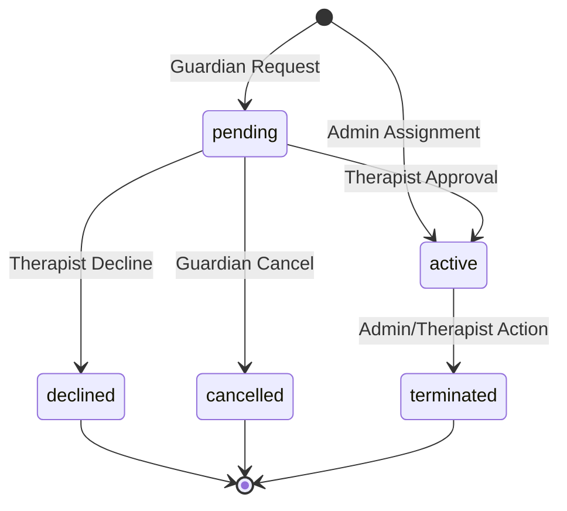

# Design Document: Therapist-Client Connection Management

## Overview

The Therapist-Client Connection Management system extends SafeSpace's existing Laravel application to provide comprehensive relationship management between therapists and clients (guardians and children). The system leverages Laravel's existing role-based authentication using Spatie permissions, builds upon the current User model structure, and integrates seamlessly with existing features like appointments, messaging, and mood tracking.

The design introduces new database tables for managing therapeutic relationships while maintaining backward compatibility with existing appointment and communication systems. It provides role-specific interfaces for connection management, search functionality, and request workflows.

## Architecture

### System Components

The system follows Laravel's MVC architecture pattern and integrates with existing SafeSpace components:

**Models Layer:**
- `TherapistClientConnection` - Core relationship model
- `ConnectionRequest` - Manages connection requests and approvals
- Extensions to existing `User` model for relationship queries

**Controllers Layer:**
- `TherapistConnectionController` - Manages therapist-side connection operations
- `ClientConnectionController` - Manages client-side connection operations  
- `AdminConnectionController` - Administrative connection management
- `ConnectionRequestController` - Handles connection request workflows

**Services Layer:**
- `ConnectionManagementService` - Core business logic for connections
- `ConnectionRequestService` - Handles request processing and notifications
- `ConnectionSearchService` - Therapist search and filtering functionality

**Integration Points:**
- Existing appointment system (filters by connections)
- Existing messaging system (enables chat between connected users)
- Existing mood tracking (visibility based on connections)
- Existing notification system (connection-related alerts)

### Database Design

**New Tables:**

```sql
-- Core therapeutic relationships
therapist_client_connections:
- id (primary key)
- therapist_id (foreign key to users)
- client_id (foreign key to users) 
- client_type (enum: 'guardian', 'child')
- connection_type (enum: 'admin_assigned', 'guardian_requested', 'guardian_child_assignment')
- status (enum: 'active', 'inactive', 'terminated')
- assigned_by (foreign key to users, nullable for requests)
- assigned_at (timestamp)
- terminated_at (timestamp, nullable)
- created_at, updated_at

-- Connection requests and approvals
connection_requests:
- id (primary key)
- requester_id (foreign key to users)
- requester_type (enum: 'guardian')
- target_therapist_id (foreign key to users)
- target_client_id (foreign key to users, nullable - for child assignments)
- request_type (enum: 'guardian_to_therapist', 'guardian_child_assignment')
- status (enum: 'pending', 'approved', 'declined', 'cancelled')
- message (text, nullable)
- reviewed_by (foreign key to users, nullable)
- reviewed_at (timestamp, nullable)
- created_at, updated_at
```

**Indexes:**
- `therapist_client_connections`: (therapist_id, status), (client_id, status)
- `connection_requests`: (target_therapist_id, status), (requester_id, status)

## Components and Interfaces

### Core Models

**TherapistClientConnection Model:**
```php
class TherapistClientConnection extends Model
{
    // Relationships
    public function therapist(): BelongsTo
    public function client(): BelongsTo  
    public function assignedBy(): BelongsTo
    
    // Scopes
    public function scopeActive(Builder $query): Builder
    public function scopeForTherapist(Builder $query, int $therapistId): Builder
    public function scopeForClient(Builder $query, int $clientId): Builder
    
    // Methods
    public function isActive(): bool
    public function terminate(User $terminatedBy): bool
}
```

**ConnectionRequest Model:**
```php
class ConnectionRequest extends Model
{
    // Relationships
    public function requester(): BelongsTo
    public function targetTherapist(): BelongsTo
    public function targetClient(): BelongsTo
    public function reviewedBy(): BelongsTo
    
    // Methods
    public function approve(User $reviewer): TherapistClientConnection
    public function decline(User $reviewer): bool
    public function cancel(): bool
}
```

### Service Classes

**ConnectionManagementService:**
```php
class ConnectionManagementService
{
    public function createAdminAssignment(int $therapistId, int $clientId, int $adminId): TherapistClientConnection
    public function getTherapistConnections(int $therapistId, string $clientType = null): Collection
    public function getClientConnections(int $clientId): Collection
    public function terminateConnection(int $connectionId, int $terminatedBy): bool
    public function getConnectionHistory(int $connectionId): Collection
}
```

**ConnectionRequestService:**
```php
class ConnectionRequestService
{
    public function createGuardianRequest(int $guardianId, int $therapistId, string $message = null): ConnectionRequest
    public function createChildAssignmentRequest(int $guardianId, int $childId, int $therapistId): ConnectionRequest
    public function processRequest(int $requestId, string $action, int $reviewerId): bool
    public function getPendingRequests(int $therapistId): Collection
    public function getGuardianRequests(int $guardianId): Collection
}
```

**ConnectionSearchService:**
```php
class ConnectionSearchService
{
    public function searchTherapists(array $filters = []): Collection
    public function getAvailableTherapists(int $guardianId): Collection
    public function filterBySpecialization(Collection $therapists, string $specialization): Collection
    public function filterByAvailability(Collection $therapists): Collection
}
```

### API Endpoints

**Therapist Endpoints:**
- `GET /api/therapist/connections` - List connected clients
- `GET /api/therapist/connections/guardians` - List connected guardians
- `GET /api/therapist/connections/children` - List connected children
- `GET /api/therapist/requests/pending` - List pending connection requests
- `POST /api/therapist/requests/{id}/approve` - Approve connection request
- `POST /api/therapist/requests/{id}/decline` - Decline connection request

**Guardian Endpoints:**
- `GET /api/guardian/connections` - List connected therapists
- `GET /api/guardian/therapists/search` - Search available therapists
- `POST /api/guardian/requests` - Create connection request
- `POST /api/guardian/children/{id}/assign` - Request child assignment
- `GET /api/guardian/requests` - List own requests

**Child Endpoints:**
- `GET /api/child/therapists` - List connected therapists

**Admin Endpoints:**
- `POST /api/admin/connections` - Create admin assignment
- `GET /api/admin/connections` - List all connections
- `DELETE /api/admin/connections/{id}` - Terminate connection
- `GET /api/admin/connections/analytics` - Connection analytics

## Data Models

### Connection Status Flow



### User Relationship Types

**Guardian-Therapist Connections:**
- Created via admin assignment or guardian request
- Enables communication and appointment scheduling
- Allows guardian to assign children to same therapist

**Child-Therapist Connections:**
- Created via admin assignment or guardian child assignment
- Enables therapeutic sessions and mood data sharing
- Provides child access to therapist communication

**Connection Metadata:**
- Connection type (admin_assigned, guardian_requested, guardian_child_assignment)
- Assignment/approval timestamps
- Termination tracking with reasons

## Correctness Properties

*A property is a characteristic or behavior that should hold true across all valid executions of a system—essentially, a formal statement about what the system should do. Properties serve as the bridge between human-readable specifications and machine-verifiable correctness guarantees.*

Based on the prework analysis and property reflection to eliminate redundancy, the following properties validate the system's correctness:

**Property 1: Admin Assignment Creates Active Connections**
*For any* valid admin user, client user, and therapist user, when the admin creates a connection assignment, the system should create a therapeutic relationship with "active" status
**Validates: Requirements 1.1, 1.2, 1.3**

**Property 2: Connection Lists Display Accurate Relationships**
*For any* user accessing their connection list, the displayed items should exactly match their active therapeutic relationships based on their role
**Validates: Requirements 2.1, 3.1, 4.1, 5.1, 7.1, 10.1**

**Property 3: Connection Information Display Completeness**
*For any* connection display, all required information fields should be present and populated according to the user's role and context
**Validates: Requirements 2.2, 2.4, 3.2, 3.4, 4.2, 4.4, 5.2, 7.2, 10.2**

**Property 4: Connection Request Creation Consistency**
*For any* guardian selecting a therapist or child-therapist combination, the system should create a connection request with "pending" status and include any provided message
**Validates: Requirements 6.3, 6.5, 8.2**

**Property 5: Notification Delivery for Connection Events**
*For any* connection-related event (assignment, request, approval, decline, termination), the system should notify all affected parties
**Validates: Requirements 1.4, 6.4, 7.4, 8.3, 8.5, 10.3**

**Property 6: Search and Filter Accuracy**
*For any* therapist search with filters, the results should contain only therapists matching the specified criteria and include all matching therapists
**Validates: Requirements 6.1, 6.2**

**Property 7: Request Processing State Changes**
*For any* connection request that is approved or declined, the system should update the request status, create appropriate relationships for approvals, and remove the request from pending lists
**Validates: Requirements 7.3, 7.5, 8.4**

**Property 8: Feature Access Based on Connections**
*For any* therapeutic relationship, connected users should have access to communication, appointment scheduling, and relevant therapeutic tools
**Validates: Requirements 2.5, 3.5, 4.5, 5.5, 9.1, 10.4**

**Property 9: Appointment Scheduling Restrictions**
*For any* appointment scheduling attempt, the system should only allow appointments between users with active therapeutic relationships
**Validates: Requirements 9.2**

**Property 10: Data Visibility Based on Connections**
*For any* child's mood data, it should be visible to all therapists with active therapeutic relationships to that child
**Validates: Requirements 9.3**

**Property 11: Connection Termination Data Preservation**
*For any* connection termination, historical data should be preserved while future interactions should be restricted
**Validates: Requirements 9.5**

**Property 12: Permission Updates on Status Changes**
*For any* connection status change, access permissions for related features should be updated to reflect the new relationship state
**Validates: Requirements 9.4**

<function_calls>
<invoke name="prework">
<parameter name="featureName">therapist-client-connections

## Error Handling

### Connection Management Errors

**Invalid User Assignments:**
- Validate user roles before creating connections (therapists must have 'therapist' role, clients must have 'guardian' or 'child' role)
- Prevent duplicate active connections between same therapist-client pairs
- Ensure child users have valid guardian relationships before assignment

**Request Processing Errors:**
- Handle concurrent request approvals/declines gracefully
- Validate request ownership before allowing modifications
- Prevent processing of already-processed requests

**Database Integrity:**
- Use database transactions for multi-table operations (connection creation + notifications)
- Implement foreign key constraints to prevent orphaned relationships
- Handle connection termination cascading to related data

**Permission Errors:**
- Validate user permissions before displaying connection lists
- Ensure only authorized users can create/modify connections
- Handle role changes that affect existing connections

### Error Response Format

```php
// API Error Response Structure
{
    "success": false,
    "error": {
        "code": "CONNECTION_ALREADY_EXISTS",
        "message": "An active connection already exists between this therapist and client",
        "details": {
            "therapist_id": 123,
            "client_id": 456,
            "existing_connection_id": 789
        }
    }
}
```

**Error Codes:**
- `CONNECTION_ALREADY_EXISTS` - Duplicate connection attempt
- `INVALID_USER_ROLE` - User lacks required role for operation
- `REQUEST_NOT_FOUND` - Connection request doesn't exist
- `REQUEST_ALREADY_PROCESSED` - Request already approved/declined
- `INSUFFICIENT_PERMISSIONS` - User lacks permission for operation
- `INVALID_CLIENT_TYPE` - Client type doesn't match operation
- `GUARDIAN_CHILD_MISMATCH` - Child doesn't belong to guardian

## Testing Strategy

### Dual Testing Approach

The system requires both unit testing and property-based testing for comprehensive coverage:

**Unit Tests:**
- Specific examples demonstrating correct behavior
- Edge cases and error conditions
- Integration points between components
- Database constraint validation

**Property-Based Tests:**
- Universal properties across all inputs using PHPUnit with Eris library
- Minimum 100 iterations per property test
- Each property test references its design document property
- Comprehensive input coverage through randomization

### Property-Based Testing Configuration

**Framework:** PHPUnit with Eris library for property-based testing in PHP
**Test Configuration:**
- Minimum 100 iterations per property test
- Each test tagged with: **Feature: therapist-client-connections, Property {number}: {property_text}**
- Random data generation for users, connections, and requests
- Constraint-based generators for valid user roles and relationships

**Example Property Test Structure:**
```php
/**
 * Feature: therapist-client-connections, Property 1: Admin Assignment Creates Active Connections
 * @test
 */
public function admin_assignment_creates_active_connections()
{
    $this->forAll(
        Generator\elements($this->getAdminUsers()),
        Generator\elements($this->getTherapistUsers()),
        Generator\elements($this->getClientUsers())
    )->then(function ($admin, $therapist, $client) {
        $connection = $this->connectionService->createAdminAssignment(
            $therapist->id, 
            $client->id, 
            $admin->id
        );
        
        $this->assertEquals('active', $connection->status);
        $this->assertEquals($therapist->id, $connection->therapist_id);
        $this->assertEquals($client->id, $connection->client_id);
    });
}
```

### Unit Testing Focus Areas

**Model Relationships:**
- Test User model connection methods
- Validate TherapistClientConnection relationships
- Test ConnectionRequest state transitions

**Service Layer Logic:**
- Connection creation and termination
- Request processing workflows
- Search and filtering functionality

**Controller Integration:**
- API endpoint responses
- Authentication and authorization
- Error handling and validation

**Database Operations:**
- Migration rollback safety
- Constraint enforcement
- Transaction handling

### Integration Testing

**Feature Integration:**
- Connection-based appointment filtering
- Message system integration with connections
- Mood data visibility based on relationships

**Notification System:**
- Connection event notifications
- Email template integration
- Real-time notification delivery

**Permission System:**
- Role-based access control
- Dynamic permission updates
- Connection-based feature access